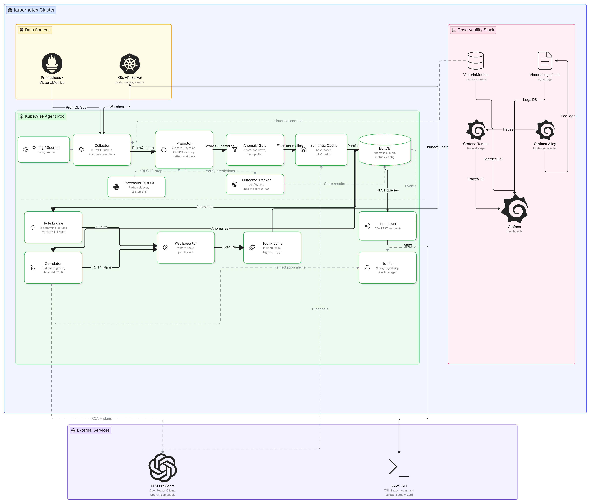

<div align="center">

# KubeWise

**Know before it breaks.**

[](LICENSE)
[](https://go.dev)
[](https://github.com/lohitkolluri/KubeWise/actions/workflows/ci.yml)
[](https://github.com/lohitkolluri/KubeWise/releases)

</div>

KubeWise lives in your cluster. It pulls metrics from Prometheus, watches your workloads, and spots trouble early. Out of the box it only observes: nothing in the cluster changes until you flip remediation on.

## Features

- **Multi-strategy anomaly detection** - robust Z-score, Bayesian changepoint, ROC scoring
- **8 built-in deterministic rules** - OOM, CrashLoop, ImagePullBackOff, NodeNotReady, Pending, ReadyRatio, CPUThrottle, MemoryPressure
- **LLM-powered root cause analysis** and remediation planning (OpenRouter, Ollama, OpenAI-compatible)
- **Multi-model LLM router** with fallback chains (T1-T4 task routing)
- **4-tier remediation** - T1 auto, T2 cooldown, T3 approval, T4 reject
- **Deterministic rule engine** for zero-cost fast-path detection
- **30s scrape cycle** with statistical prediction and gRPC forecaster sidecar (12-step-ahead)
- **Tool plugin system** - kubectl, helm, ArgoCD, Terraform, GitHub CLI
- **Full TUI dashboard** - 8 tabs, command palette, mouse support
- **Helm chart** with optional observability subcharts (VictoriaMetrics, VictoriaLogs, Tempo, Alloy)
- **Notifications** - Slack, PagerDuty, Alertmanager, webhook

## Architecture

<p align="center">
  
</p>

Every 30s: scrape Prometheus metrics → statistical anomaly detection (Z-score + changepoint + ROC) → domain pattern matching (OOM, CrashLoop, Degradation) → anomaly gate (noise filter) → BoltDB store → forecaster sidecar (gRPC, 12-step predictions). Remediation: load open anomalies → rule engine (fast path, 8 rules) → LLM investigation (via router) → plan normalization → tier assignment → approval gate (T3) → K8s executor → verification → audit. The observability stack (VM/VL/Tempo/Alloy) feeds metrics, logs, and traces into the LLM investigation phase for richer context.

See [docs/architecture.md](docs/architecture.md) for detailed deep-dives into the detection pipeline, remediation pipeline, and deployment architecture. The diagram is also available on [Eraser](https://app.eraser.io/workspace/5GNpsJrTxsUXCS1fyk8j?diagram=eNhhpazn2U7TZNSOEb8q&layout=canvas).

### Feature-gated capabilities

Deterministic rule detection, semantic incident caching, multi-model LLM routing, prompt compression, Kubernetes event correlation, tool plugins, and the observability subcharts are all gated behind feature flags. All default to `true` since v2. Set the corresponding env var to `false` to disable.

See the [migration guide](docs/MIGRATION.md) for a flag-by-flag upgrade path.

## Install

You need `kubectl` and a cluster with Prometheus. The installer looks for Prometheus on its own.

### npm (macOS / Linux)

```bash
npm install -g kwctl
# or
npm install -g kubewise-cli

kwctl version
kwctl install --yes
# production: kwctl install --helm --yes
```

Same binary either way. Node 18+.

### Helm

```bash
helm install kubewise ./charts/kubewise \
  --namespace kubewise --create-namespace \
  --set secrets.openrouterApiKey=$OPENROUTER_API_KEY \
  --set persistence.enabled=true \
  --set security.requireApiToken=true \
  --set secrets.apiToken=$(openssl rand -hex 24)
```

Namespace-scoped RBAC (no ClusterRole):

```bash
helm install kubewise ./charts/kubewise \
  --set rbac.clusterScoped=false \
  --set agent.watchNamespaces="{demo,staging}"
```

### curl

```bash
curl -fsSL https://raw.githubusercontent.com/lohitkolluri/KubeWise/main/hack/bootstrap.sh | bash
```

Or install `kwctl` from GitHub Releases first:

```bash
curl -fsSL https://raw.githubusercontent.com/lohitkolluri/KubeWise/main/hack/install.sh | bash
kwctl install --yes
```

### Local dev (kind) - fastest path

Requires **Docker Desktop** (running), kind, helm, kubectl.

```bash
git clone https://github.com/lohitkolluri/KubeWise.git && cd KubeWise
export OPENROUTER_API_KEY="sk-or-..."   # optional - enables LLM runbooks
make dev                                # or: ./hack/bootstrap.sh --local --yes
./bin/kwctl up
./bin/kwctl ui
```

Check setup: `./bin/kwctl doctor`

### LLM remediation (optional)

```bash
export OPENROUTER_API_KEY="sk-or-..."
kwctl install --yes
```

No API key? Predictions and the HTTP API still work. You just won't get LLM runbooks.

### Ollama (local / air-gapped)

```bash
# set in agent config.yaml or env
export OLLAMA_BASE_URL="http://ollama:11434"
# llm_provider: ollama
# llm_model: llama3.1:8b
```

### Slack / webhook notifications

Enable in agent `config.yaml`:

```yaml
notifications:
  enabled: true
  slack_webhook_url: https://hooks.slack.com/services/...
  min_score: 0.7
```

## Usage

```bash
kwctl up          # port-forward + health check
kwctl connect
kwctl status
kwctl             # opens the TUI
```

Running `kwctl` with no arguments opens the dashboard: predictions, anomalies, audit trail, approvals, config, logs. `Ctrl+P` opens the command palette. `?` lists shortcuts.

| Command | Description |
|---------|-------------|
| `kwctl` (no args) | Open TUI dashboard |
| `kwctl up` | Port-forward + health check |
| `kwctl install` | Install agent (Helm/kustomize/wizard) |
| `kwctl predict` | Show predictions |
| `kwctl anomalies` | Show anomalies |
| `kwctl remediation` | Show remediation records |
| `kwctl audit` | Show audit trail |
| `kwctl stats` | Show agent stats |
| `kwctl status` | Agent status/health |
| `kwctl logs -f` | Tail agent logs |
| `kwctl events` | Show K8s events |
| `kwctl secrets` | Manage secrets |
| `kwctl doctor` | Environment diagnostics |
| `kwctl up/down` | Port-forward management |

Config is at `~/.config/kwctl/config.yaml`.

## API

After connecting (recommended):

```bash
kwctl up
curl localhost:8080/status
curl localhost:8080/api/v1/predictions
curl localhost:8080/api/v1/anomalies
curl localhost:8080/api/v1/stats
```

Manual port-forward (fallback):

- Helm install: `kubectl -n kubewise port-forward svc/kubewise 8080:8080`
- Manifests install: `kubectl -n kubewise port-forward svc/kubewise-agent 8080:8080`

| Method | Path | Description |
|--------|------|-------------|
| GET | `/health` | Liveness probe |
| GET | `/readyz` | Readiness probe (store ping) |
| GET | `/status` | Agent status |
| GET | `/metrics` | Prometheus metrics |
| POST | `/api/v1/auth` | Password to token exchange |
| GET | `/api/v1/predictions` | Latest predictions |
| GET | `/api/v1/anomalies?limit=N` | Anomaly list |
| GET/PUT | `/api/v1/config` | Agent config |
| GET | `/api/v1/remediations` | Audit records |
| GET | `/api/v1/audit[?status=&since=]` | Filtered audit |
| GET | `/api/v1/audit/{id}` | Single audit record |
| GET | `/api/v1/stats` | Agent statistics |
| GET | `/api/v1/approvals` | Pending T3 approvals |
| POST | `/api/v1/approvals/{id}/approve` | Approve remediation |
| POST | `/api/v1/approvals/{id}/reject` | Reject remediation |
| GET/PUT | `/api/v1/remediation/mode` | Mode toggle |
| GET | `/api/v1/health` | Health scores |
| GET | `/api/v1/health/history` | Score history |
| GET | `/api/v1/health/summary` | Cluster summary |
| GET | `/api/v1/accuracy` | Latest accuracy |
| GET | `/api/v1/accuracy/history` | Accuracy history |
| GET | `/api/v1/admin/backup` | DB backup |

## Remediation

Actions are grouped by how risky they are:

| Tier | Examples | What happens |
| ---- | -------- | ------------ |
| T1 | restart/delete pod | auto in live mode |
| T2 | scale, rollback, patch resources | auto, 5 min cooldown |
| T3 | escalate | needs your approval |
| T4 | unknown / cluster-wide | rejected |

## Configuration

Agent config at `~/.config/kwctl/config.yaml` (profiles), in-cluster config via environment variables or Helm values. See `charts/kubewise/values.yaml` for the full configuration surface.

## Develop

```bash
make kind-up        # kind + prometheus + deploy
make deploy-dev     # rebuild and rollout
make test
make port-forward   # (fallback) manual port-forward for manifests installs
```

Go 1.26+, Docker. Local clusters: [kind](https://kind.sigs.k8s.io/) and Helm.

See [CONTRIBUTING.md](CONTRIBUTING.md) for repo layout, lint targets, and PR expectations.

## Community

[Code of Conduct](CODE_OF_CONDUCT.md) &middot; [Governance](GOVERNANCE.md) &middot; [Security](SECURITY.md) &middot; [Support](SUPPORT.md)

### Releasing

Push a `vX.Y.Z` tag on `main`. GoReleaser cuts GitHub Release binaries and publishes `kwctl` and `kubewise-cli` to npm. Set `NPM_TOKEN` in repo secrets ([npm automation token](https://docs.npmjs.com/about-access-tokens)). npm publish happens automatically in CI.

```bash
goreleaser release --snapshot --clean
```

## License

Apache-2.0. See [LICENSE](LICENSE) and [NOTICE](NOTICE).
