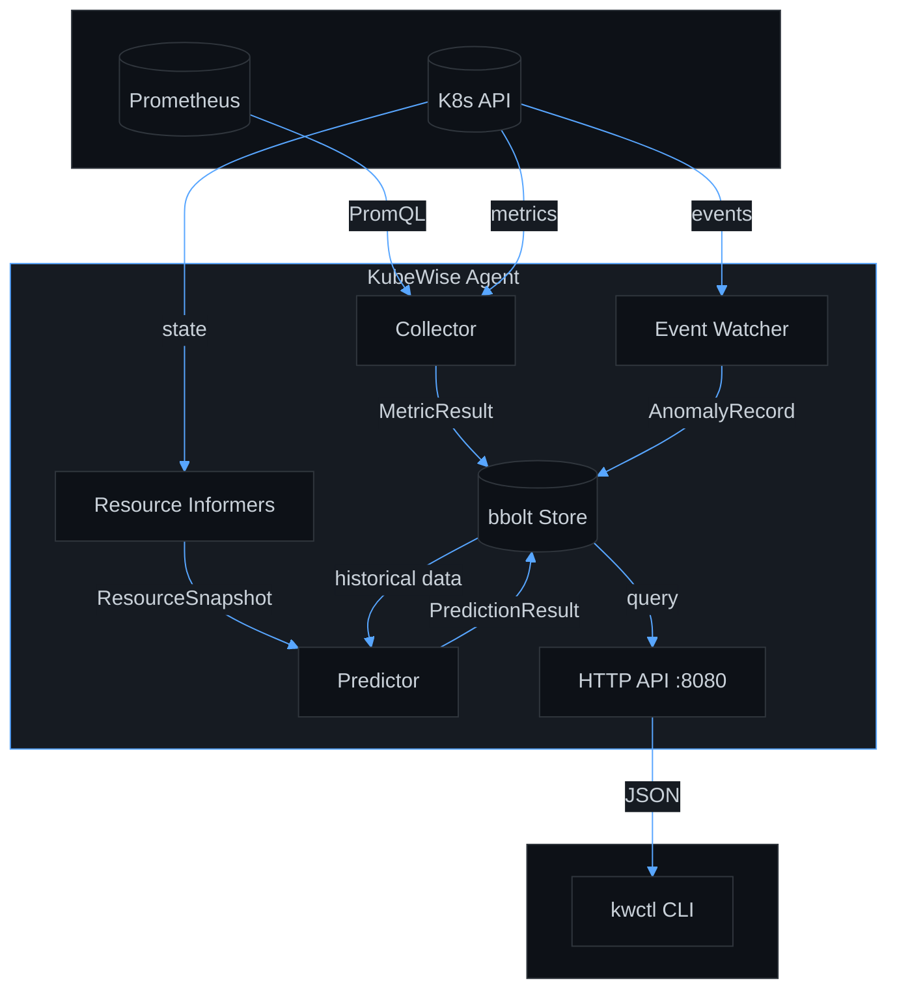
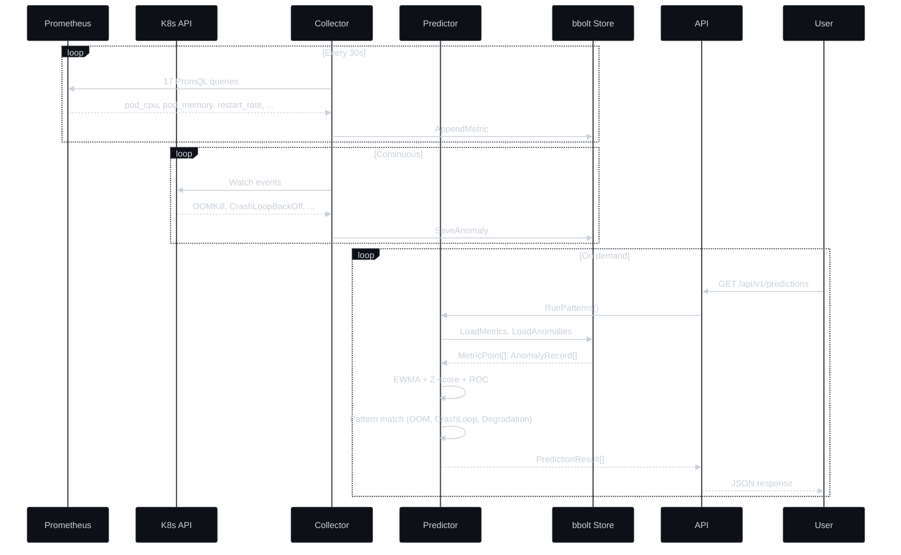

<nav align="center">
  
  
  
  
</nav>

<h1 align="center">KubeWise <sup>v2</sup></h1>
<p align="center"><b>Know before it breaks.</b> Predicting Kubernetes failures before they happen — with statistical models and pattern matching.</p>

<br>


```mermaid
%%{init: {'theme': 'base', 'themeVariables': { 'primaryColor': '#0d1117', 'primaryTextColor': '#c9d1d9', 'primaryBorderColor': '#30363d', 'lineColor': '#58a6ff', 'secondaryColor': '#161b22', 'tertiaryColor': '#21262d' }}}%%
flowchart TB
    subgraph Input[" "]
        P[("Prometheus")]
        K[("K8s API")]
    end

    subgraph Agent["KubeWise Agent"]
        direction TB
        C[Collector]
        E[Event Watcher]
        I[Resource Informers]
        PR[Predictor]
        ST[(bbolt Store)]
        API[HTTP API :8080]
    end

    subgraph Output[" "]
        CLI[kwctl CLI]
    end

    P -->|PromQL| C
    K -->|metrics| C
    K -->|events| E
    K -->|state| I

    C -->|MetricResult| ST
    E -->|AnomalyRecord| ST
    I -->|ResourceSnapshot| PR

    ST -->|historical data| PR
    PR -->|PredictionResult| ST
    ST -->|query| API
    API -->|JSON| CLI

    style Input fill:#0d1117,stroke:#30363d,color:#8b949e
    style Output fill:#0d1117,stroke:#30363d,color:#8b949e
    style Agent fill:#161b22,stroke:#58a6ff,color:#c9d1d9
```

---

## Quick Start

```bash
# Build the CLI
go build -o bin/kwctl ./cmd/kwctl/

# Spin up a dev cluster (requires kind + helm)
./hack/kind-cluster.sh

# Port-forward and inspect
kubectl -n kubewise port-forward svc/kubewise-agent 8080:8080 &

bin/kwctl status          # agent health, uptime, scrape count
bin/kwctl config          # active configuration
bin/kwctl predict         # failure predictions
```

---

## Pipeline


```mermaid
%%{init: {'theme': 'base', 'themeVariables': { 'primaryColor': '#0d1117', 'primaryTextColor': '#c9d1d9', 'primaryBorderColor': '#30363d', 'lineColor': '#58a6ff', 'secondaryColor': '#161b22', 'tertiaryColor': '#21262d' }}}%%
sequenceDiagram
    participant Prom as Prometheus
    participant K8s as K8s API
    participant C as Collector
    participant Pr as Predictor
    participant S as bbolt Store
    participant A as API
    participant U as User

    loop Every 30s
        C->>Prom: 17 PromQL queries
        Prom-->>C: pod_cpu, pod_memory, restart_rate, ...
        C->>S: AppendMetric
    end

    loop Continuous
        C->>K8s: Watch events
        K8s-->>C: OOMKill, CrashLoopBackOff, ...
        C->>S: SaveAnomaly
    end

    loop On demand
        U->>A: GET /api/v1/predictions
        A->>Pr: RunPatterns()
        Pr->>S: LoadMetrics, LoadAnomalies
        S-->>Pr: MetricPoint[], AnomalyRecord[]
        Pr->>Pr: EWMA + Z-score + ROC
        Pr->>Pr: Pattern match (OOM, CrashLoop, Degradation)
        Pr-->>A: PredictionResult[]
        A-->>U: JSON response
    end
```

---

## CLI

```bash
# Three subcommands, three output formats
kwctl status              # agent uptime, started at, scrape count
kwctl config              # scrape interval, prometheus, llm, remediation mode
kwctl predict             # active predictions with confidence scores

# Format control
kwctl status  -o table    # default — formatted columns
kwctl config  -o json     # machine-readable
kwctl predict -o yaml     # structured output

# Agent targeting
kwctl status -n kubewise -s kubewise-agent
```

| Command | Description |
|---|---|
| `kwctl status` | Agent uptime, scrapes, health |
| `kwctl config` | Show agent configuration |
| `kwctl predict` | Active failure predictions |

---

## API

| Method | Path | Description |
|--------|------|-------------|
| `GET` | `/health` | Liveness probe — returns `{"status":"ok"}` |
| `GET` | `/status` | Uptime, started timestamp, total scrapes |
| `GET` | `/api/v1/predictions` | Active failure predictions |
| `GET` | `/api/v1/anomalies` | Recent anomalies (`?limit=N`) |
| `GET` | `/api/v1/config` | Agent configuration |

All responses are JSON. Unknown routes return `{"error":"not found"}` with `404`.

---

## Components

### Collector
17 PromQL queries across pods, nodes, and deployments — CPU, memory, restart rate, OOMKilled count, CrashLoopBackOff, ImagePullBackOff, node pressure signals, deployment replica health, TCP retransmit, DNS failures. Also watches raw K8s events and runs resource informers for real-time pod/node/deployment state.

### Predictor
Three statistical models feeding into a weighted scorer:

| Model | Weight | Purpose |
|---|---|---|
| **EWMA** (α=0.3) | 0.25 | Detects level shifts — sustained change from baseline |
| **Z-score** (σ=10) | 0.50 | Flags statistically significant deviations |
| **Rate-of-Change** | 0.25 | Catches acceleration — velocity of metric change |

Plus three pattern matchers that combine signal analysis with event cues:

- **OOMRisk** — rising memory trend + recent OOMKilled events
- **CrashLoop** — elevated restart rate + CrashLoopBackOff status
- **Degradation** — NotReady pods + node pressure events

### Store
Embedded **bbolt** database with buckets for metrics, anomalies, and config. Ring-buffer semantics on metric storage — configurable max samples per key, oldest evicted first. Zero external databases.

### API
Go 1.22+ `net/http` stdlib routing — no framework. JSON-only responses, CORS headers, request logging middleware, 404s return JSON not HTML. Designed for in-cluster deployments behind a ClusterIP service.

---

## Deployment

```bash
# Apply manifests to any cluster
kubectl apply -f manifests/

# Build and deploy locally (requires kind)
./hack/deploy-dev.sh
```

| Manifest | Purpose |
|---|---|
| `00-namespace.yaml` | `kubewise` namespace |
| `10-serviceaccount.yaml` | Agent service account |
| `20-clusterrole.yaml` | RBAC — pods, nodes, events, deployments, leases |
| `30-configmap.yaml` | Default agent config (30s scrape, dry-run remediation) |
| `40-deployment.yaml` | Single replica, config volume, emptyDir data, probes |
| `50-service.yaml` | ClusterIP on port 8080 |

---

## Development

```bash
# Full dev loop
./hack/kind-cluster.sh     # kind cluster + Prometheus + deploy agent
./hack/deploy-dev.sh       # rebuild + redeploy

# Run tests
go test ./...              # 6 packages — collector, store, predictor, api, cli, k8s
```

See [DESIGN.md](DESIGN.md) for architecture decisions and development guide.

---

<footer align="center">
  <small>MIT · <a href="https://github.com/lohitkolluri/KubeWise">github.com/lohitkolluri/KubeWise</a></small>
</footer>
