<div align="center">

# KubeWise 🛡️

<h2>AI-Powered Guardian for Kubernetes: Detect, Diagnose, Defend</h2>

```
╔═══════════════════════════════════════════════════════════════════╗
║                                                                   ║
║   ██╗  ██╗██╗   ██╗██████╗ ███████╗██╗    ██╗██╗███████╗███████╗  ║
║   ██║ ██╔╝██║   ██║██╔══██╗██╔════╝██║    ██║██║██╔════╝██╔════╝  ║
║   █████╔╝ ██║   ██║██████╔╝█████╗  ██║ █╗ ██║██║███████╗█████╗    ║
║   ██╔═██╗ ██║   ██║██╔══██╗██╔══╝  ██║███╗██║██║╚════██║██╔══╝    ║
║   ██║  ██╗╚██████╔╝██████╔╝███████╗╚███╔███╔╝██║███████║███████╗  ║
║   ╚═╝  ╚═╝ ╚═════╝ ╚═════╝ ╚══════╝ ╚══╝╚══╝ ╚═╝╚══════╝╚══════╝  ║
║                                                                   ║
╚═══════════════════════════════════════════════════════════════════╝
```

**Transform your Kubernetes experience with autonomous anomaly detection, AI-powered diagnosis, and intelligent remediation**

[](LICENSE)
[](https://www.python.org/downloads/)
[]()

</div>

> *"Let KubeWise handle the chaos while you focus on innovation"*

KubeWise is an intelligent system designed to proactively monitor Kubernetes clusters, detect anomalies using a combination of machine learning and direct failure checks, leverage AI (Google Gemini) for deep analysis and remediation planning, and optionally automate the remediation process. It aims to improve cluster stability, reduce downtime, and streamline operations for SREs and DevOps teams.

---

## 📑 Table of Contents
- [Demo](#-demo)
- [Key Features](#-key-features)
- [Novelties & Why KubeWise?](#-novelties--why-kubewise)
- [Architecture & Workflow](#-architecture--workflow)
- [Prerequisites](#-prerequisites)
- [Setup & Installation](#-setup--installation)
- [Running the Application](#-running-the-application)
- [API Endpoints & Usage](#-api-endpoints--usage)
- [Configuration](#-configuration)
- [License](#-license)

---

## 🎬 Demo

Watch KubeWise in action! This video showcases its key features, from anomaly detection to AI-driven remediation.

<div align="center">

[](https://youtu.be/PxobbNKy1Kc)

**(Click the image to watch the demo on YouTube)**
</div>

---

## ✨ Key Features

*   **Real-time Monitoring:** Continuously scrapes metrics from Prometheus using configurable PromQL queries.
*   **Hybrid Anomaly Detection:**
    *   **Deep Learning-Based:** Uses a Keras Autoencoder model for identifying subtle deviations from normal behavior through reconstruction error.
        *   **Model Performance:**
            | Label | Precision | Recall | F1-score |
            |-------|-----------|--------|----------|
            | Normal (0) | 0.90 | 0.96 | 0.93 |
            | Anomaly (1) | 0.92 | 0.80 | 0.85 |
            | **Overall Accuracy:** | **91%** | | |
    *   **Direct Failure Scanning:** Proactively scans Kubernetes API for explicit failure states (e.g., Failed Pods, NotReady Nodes).
    *   **Threshold Breaching:** Detects immediate issues when critical metric thresholds are crossed.
    *   **Predictive Forecasting:** Predicts potential future failures based on metric trends.
*   **AI-Powered Analysis (Gemini):**
    *   **Root Cause Analysis:** Provides insights into the likely causes of anomalies and failures.
    *   **Remediation Suggestions:** Generates specific `kubectl` or structured K8s commands tailored to the problem.
    *   **Verification:** Assesses whether applied remediation actions were successful.
    *   **Query Generation:** Can automatically generate relevant PromQL queries based on cluster context.
*   **Autonomous Remediation:**
    *   **MANUAL Mode:** Detects anomalies, analyzes them, and suggests remediation steps for user approval.
    *   **AUTO Mode:** Automatically executes validated, safe remediation steps based on detected issues, criticality, and configuration.
*   **Safety First:** Validates generated remediation commands against a safe list and uses structured parameters for execution via the Kubernetes Python client. Blacklisting of operations is also supported.
*   **Adaptive Learning:** The ML model can be retrained automatically as more data becomes available.
*   **Observability:** Exposes internal metrics via a Prometheus client endpoint and provides API endpoints for status, configuration, and event management.
*   **Persistent Storage:** Uses SQLite to store anomaly events and remediation history.
*   **Configuration:** Easily configurable via environment variables (`.env` file).

---

## 💡 Novelties & Why KubeWise?

*   **Multi-Faceted Detection:** Goes beyond traditional monitoring by combining ML anomaly scores, direct K8s failure states, threshold checks, and predictive forecasting for faster, more accurate issue identification.
*   **True Autonomy:** The background worker enables a continuous monitor-detect-analyze-remediate-verify loop.
*   **Deep AI Integration:** Leverages Google Gemini not just for analysis but also for suggesting *and* verifying actions, closing the feedback loop. Gemini can even help bootstrap the monitoring itself via query generation.
*   **Context-Aware Remediation:** Tailors remediation commands based on the specific entity type (Pod, Deployment, Node), the nature of the failure (e.g., `CrashLoopBackOff` vs. threshold breach), and whether it's a current or predicted issue.
*   **Safety and Validation Focus:** Prioritizes safe execution by parsing and validating commands before applying them, distinguishing between standard, critical, and proactive remediation scenarios.
*   **Persistent Event Tracking:** Maintains a history of anomalies and remediation attempts in a local SQLite database for auditability and analysis.

---

## 🏗️ Architecture & Workflow

KubeWise operates through a central `AutonomousWorker` that orchestrates the monitoring and remediation process.

### 📊 Architecture Diagram

```mermaid
flowchart TD
    subgraph "Kubernetes Cluster"
        Prometheus[📈 Prometheus Metrics]
        K8sAPI[☸️ Kubernetes API]
    end

    subgraph "KubeWise Application"
        A[PrometheusScraper] -->|Fetches Metrics| B(AutonomousWorker)
        K8sAPI -->|Fetches K8s Status| J(K8sExecutor)
        J -->|Direct Failure Info| B

        B -->|Stores Metric History| C(Metric History - in-memory)
        C -->|Provides Window| D(AnomalyDetector ML Model)
        B -->|Latest Metrics| D

        D -->|Anomaly/Failure Detected| E[AnomalyEventService]
        E -->|Stores Event| F[(💾 SQLite DB)]

        B -->|Triggers Analysis/Remediation| G(GeminiService AI 🧠)
        E -->|Provides Event Context| G
        J -->|Provides Cluster Context| G

        G -->|Analysis & Suggestions| E
        G -->|PromQL Queries| B

        B -->|"Executes Remediation (AUTO Mode)"| J
        J -->|Interacts With| K8sAPI

        B -->|Triggers Verification| G
        J -->|Fetches Current State| G
        E -->|Provides Attempt Info| G
        G -->|Verification Result| E

        User[👤 User / API Client] <-->|"API Calls (FastAPI)"| KubeWiseAPI{API Routers}
        KubeWiseAPI <--> E
        KubeWiseAPI <--> G
        KubeWiseAPI <--> J
        KubeWiseAPI <--> D
        KubeWiseAPI <--> B
    end

    Prometheus --> A

    %% Define straight lines for all edges
    linkStyle default stroke-width:2px,fill:none,stroke:gray;

    classDef user fill:#d14,stroke:#333,stroke-width:2px
    classDef api fill:#0366d6,stroke:#333,stroke-width:1px,color:#fff
    classDef ai fill:#6f42c1,stroke:#333,stroke-width:1px,color:#fff
    classDef storage fill:#2ea44f,stroke:#333,stroke-width:1px,color:#fff

    class User user
    class KubeWiseAPI api
    class G ai
    class F storage
```



### 🔄 Operational Workflow: 10-Step Process

1.  **Scrape:** `PrometheusScraper` fetches metrics based on active PromQL queries.
2.  **Direct Scan:** `K8sExecutor` queries the K8s API directly for resources in failure states (complementary to metrics).
3.  **Process & Store:** `AutonomousWorker` updates the in-memory metric history for each entity.
4.  **Detect:** `AnomalyDetector` uses the Keras Autoencoder model and direct checks (thresholds, K8s status) on the latest metrics and history to detect anomalies, failures, or predict future issues.
5.  **Record:** If an anomaly/failure is detected, an event is created via `AnomalyEventService` and stored in SQLite.
6.  **Analyze (Gemini):** `GeminiService` analyzes the event context (metrics, status) to determine root cause and suggest remediation commands.
7.  **Decide & Remediate (AUTO Mode):** `AutonomousWorker` validates suggested commands (from Gemini or fallback logic) using `K8sExecutor`. If in `AUTO` mode and the command is deemed safe for the context (critical/predicted/standard), `K8sExecutor` applies it via the Kubernetes API. Remediation attempts are recorded.
8.  **Suggest (MANUAL Mode):** If in `MANUAL` mode, validated suggestions are stored in the event for user review via the API.
9.  **Verify (AUTO Mode):** After a delay, `AutonomousWorker` triggers `GeminiService` (if enabled) or uses `AnomalyDetector` to check if the remediation was successful by examining current metrics and K8s status. The event status is updated.
10. **API Interaction:** Users can view events, trigger analysis/remediation manually, check system health, and configure the mode via the FastAPI interface.

---

## ⚙️ Prerequisites

<table>
<tr>
<td>Python</td>
<td>Version 3.8 or higher</td>
</tr>
<tr>
<td>Kubernetes Cluster</td>
<td>Access to a Kubernetes cluster (e.g., Minikube, Kind, GKE, EKS, AKS)</td>
</tr>
<tr>
<td>kubectl</td>
<td>Configured to connect to your cluster</td>
</tr>
<tr>
<td>Prometheus</td>
<td>Deployed in your cluster (e.g., via Helm chart, kube-prometheus-stack) and accessible to KubeWise</td>
</tr>
<tr>
<td>Gemini API Key</td>
<td>Required for AI-powered analysis. Get one from <a href="https://aistudio.google.com/app/apikey">Google AI Studio</a></td>
</tr>
<tr>
<td>jq (Optional)</td>
<td>Useful for formatting JSON output when interacting with the API</td>
</tr>
</table>

> **Note:** KubeWise assumes it can reach Prometheus at the configured `PROMETHEUS_URL`. AI features will be limited without a valid Gemini API key.

---

## 🚀 Setup & Installation

### 1. Clone the Repository
Clone the repo and navigate to the directory
```bash
git clone https://github.com/lohitkolluri/KubeWise
cd KubeWise
```

### 2. Create and Activate a Virtual Environment
Set up Python virtual environment
```bash
python3 -m venv venv
source venv/bin/activate  # On Windows use `venv\Scripts\activate`
```

### 3. Install Dependencies
Install required packages
```bash
pip install -r requirements.txt
```

> 📦 **Package Requirements**: Ensure you have a `requirements.txt` file containing packages like `fastapi`, `uvicorn`, `loguru`, `requests`, `kubernetes`, `scikit-learn`, `joblib`, `google-generativeai`, `sqlalchemy`, `aiosqlite`, `prometheus-client`, `pydantic-settings`, `httpx`, `aiohttp`, `gunicorn`, etc.

### 4. Configure Environment Variables
Create and configure environment file
```bash
cp .env.example .env
```

<div style="background-color: #f6f8fa; padding: 10px; border-left: 4px solid #0366d6; margin-bottom: 10px;">
<strong>Configuration Example:</strong>

```dotenv
# .env Example
LOG_LEVEL=INFO
DEFAULT_REMEDIATION_MODE=AUTO

# --- Monitoring ---
PROMETHEUS_PORT=9090

# --- Worker ---
WORKER_SLEEP_INTERVAL_SECONDS=15

# --- Gemini AI ---
GEMINI_API_KEY="YOUR_GEMINI_API_KEY_HERE" # !!! REQUIRED for AI features !!!
GEMINI_AUTO_ANALYSIS=True         # Use AI for analysis & remediation suggestions?
GEMINI_AUTO_VERIFICATION=True     # Use AI to verify remediation?

# ... other remediation settings can be modified from config.py ...
```
</div>

> ⚠️ **Important**: Set your `GEMINI_API_KEY`. If left blank, AI features will be disabled. Ensure `PROMETHEUS_PORT` is correct.

### 5. Port-Forward Prometheus
Make Prometheus accessible locally
```bash
# Find the Prometheus service name
kubectl get svc -n monitoring

# Port-forward (adjust namespace and service name as needed)
kubectl port-forward svc/prometheus-kube-prometheus-prometheus 9090:9090 -n monitoring
```

> 🔍 **Verification**: Keep this terminal running. Verify access by opening `http://localhost:9090` in your browser.

---

## ▶️ Running the Application

You can run KubeWise in development mode (with auto-reload) or production mode.

<div align="center">

| Mode | Use Case | Command |
|------|----------|---------|
| **Development** | Local testing with auto-reload | `uvicorn app.main:app --reload --host 0.0.0.0 --port 8000` |
| **Production** | Deployment with multiple workers | `gunicorn app.main:app -w 4 -k uvicorn.workers.UvicornWorker -b 0.0.0.0:8000` |

</div>

### Development Mode (using Uvicorn)

Ideal for local development and testing.

```bash
uvicorn app.main:app --reload --host 0.0.0.0 --port 8000
```

*   `--reload`: Automatically restarts the server when code changes are detected.
*   `--host 0.0.0.0`: Makes the server accessible on your local network.
*   `--port 8000`: Specifies the port to run on.

### Production Mode (using Gunicorn)

Recommended for deployment scenarios. Gunicorn manages multiple Uvicorn workers for better performance and reliability.

```bash
gunicorn app.main:app -w 4 -k uvicorn.workers.UvicornWorker -b 0.0.0.0:8000
```

*   `-w 4`: Specifies the number of worker processes (adjust based on your server's CPU cores, typically `2 * num_cores + 1`).
*   `-k uvicorn.workers.UvicornWorker`: Tells Gunicorn to use Uvicorn to handle requests asynchronously.
*   `-b 0.0.0.0:8000`: Binds the server to the specified address and port.

> 🚀 Once started, KubeWise will initialize, perform health checks, start the autonomous worker, and begin monitoring your cluster. The API will be available at `http://localhost:8000`.

---

## 🔌 API Endpoints & Usage

Interact with KubeWise using standard HTTP requests. `curl` examples are provided below.

**(Base URL: `http://localhost:8000`)**

### Root & Health Endpoints

#### Root

*   **`GET /`**
    *   Description: Get basic application info.
    *   `curl -X GET "http://localhost:8000/"`

#### Health

*   **`GET /api/v1/health/`**
    *   Description: Check the health status of KubeWise and its dependencies (Prometheus, Gemini, Kubernetes connectivity).
    *   `curl -X GET "http://localhost:8000/api/v1/health/" | jq`

### Setup & Configuration Endpoints

#### Setup

*   **`GET /api/v1/setup/mode`**
    *   Description: Get the current remediation mode (`AUTO` or `MANUAL`).
    *   `curl -X GET "http://localhost:8000/api/v1/setup/mode" | jq`
*   **`PUT /api/v1/setup/mode`**
    *   Description: Set the remediation mode.
    *   `curl -X PUT "http://localhost:8000/api/v1/setup/mode" -H "Content-Type: application/json" -d '{"mode": "AUTO"}' | jq`
    *   `curl -X PUT "http://localhost:8000/api/v1/setup/mode" -H "Content-Type: application/json" -d '{"mode": "MANUAL"}' | jq`
*   **`GET /api/v1/setup/config`**
    *   Description: Get the current application configuration (sensitive data excluded).
    *   `curl -X GET "http://localhost:8000/api/v1/setup/config" | jq`

### Metrics & Model Endpoints

#### Metrics

*   **`GET /api/v1/metrics/`**
    *   Description: Fetch the latest metrics snapshot from Prometheus for all monitored entities.
    *   `curl -X GET "http://localhost:8000/api/v1/metrics/" | jq`
*   **`GET /api/v1/metrics/queries`**
    *   Description: Get the list of active PromQL queries used for monitoring.
    *   `curl -X GET "http://localhost:8000/api/v1/metrics/queries" | jq`
*   **`GET /api/v1/metrics/model/info`**
    *   Description: Get information about the anomaly detection model (status, parameters).
    *   `curl -X GET "http://localhost:8000/api/v1/metrics/model/info" | jq`

### Anomalies & Remediation Endpoints

#### Anomalies

*   **`POST /api/v1/anomalies/analyze/{anomaly_id}`**
    *   Description: Trigger AI analysis for a specific anomaly event. Requires Gemini API key.
    *   `curl -X POST "http://localhost:8000/api/v1/anomalies/analyze/YOUR_ANOMALY_EVENT_ID" | jq`

#### Remediation

*   **`GET /api/v1/remediation/events`**
    *   Description: List detected anomaly events. Filter by status (e.g., `?status=Detected`, `?status=RemediationSuggested`).
    *   `curl -X GET "http://localhost:8000/api/v1/remediation/events?limit=10" | jq`
    *   `curl -X GET "http://localhost:8000/api/v1/remediation/events?status=RemediationSuggested" | jq`
*   **`GET /api/v1/remediation/events/{anomaly_id}`**
    *   Description: Get details for a specific anomaly event.
    *   `curl -X GET "http://localhost:8000/api/v1/remediation/events/YOUR_ANOMALY_EVENT_ID" | jq`
*   **`POST /api/v1/remediation/events/{anomaly_id}/remediate`**
    *   Description: Manually execute a specific remediation command for an anomaly event. Use commands listed by `/commands` or suggested in the event details.
    *   `curl -X POST "http://localhost:8000/api/v1/remediation/events/YOUR_ANOMALY_EVENT_ID/remediate" -H "Content-Type: application/json" -d '{"command": "restart_deployment name=my-app namespace=dev"}' | jq`
*   **`GET /api/v1/remediation/commands`**
    *   Description: List available, validated Kubernetes commands that KubeWise can execute.
    *   `curl -X GET "http://localhost:8000/api/v1/remediation/commands" | jq`

---

## 🔧 Configuration

KubeWise uses environment variables for configuration, typically loaded from a `.env` file in the project root.

### Configuration Options

| Variable | Description | Default |
|----------|-------------|---------|
| `PROMETHEUS_URL` | Endpoint for your Prometheus server | `http://localhost:9090` |
| `GEMINI_API_KEY` | Your Google Gemini API Key | None (required for AI) |
| `DEFAULT_REMEDIATION_MODE` | Set to `MANUAL` or `AUTO` | `MANUAL` |
| `LOG_LEVEL` | Controls log verbosity | `INFO` |
| `WORKER_SLEEP_INTERVAL_SECONDS` | How often monitoring cycle runs | `15` |
| `PROMETHEUS_SCRAPE_INTERVAL_SECONDS` | Frequency of metric collection | `15` |
| `ANOMALY_METRIC_WINDOW_SECONDS` | Duration of metric history kept | `3600` |
| `AUTOENCODER_MODEL_PATH` | Path to the Keras autoencoder model | `models/kube_anomaly_autoencoder.keras` |
| `AUTOENCODER_SCALER_PATH` | Path to the model's scaler file | `models/kube_anomaly_scaler.joblib` |
| `AUTOENCODER_THRESHOLD` | Threshold for anomaly detection (MSE value) | `0.161025` |
| `GEMINI_AUTO_QUERY_GENERATION` | Enable AI PromQL generation | `False` |
| `GEMINI_AUTO_ANALYSIS` | Enable AI analysis | `True` |
| `GEMINI_AUTO_VERIFICATION` | Enable AI verification | `True` |
| `AUTO_REMEDIATE_CRITICAL` | Auto-fix critical issues | `False` |

> 📝 Refer to `app/core/config.py` for the full list of settings and their defaults.

## 📄 License

Distributed under the Proprietary License. See [`LICENSE`](LICENSE) file for more information.
