<div align="center">

# KubeWise 🛡️

<h2>Your AI-Powered Guardian for Kubernetes: Autonomously Detect, Diagnose, Defend & Dominate Cluster Complexity</h2>

```
╔═══════════════════════════════════════════════════════════════════╗
║                                                                   ║
║   ██╗  ██╗██╗   ██╗██████╗ ███████╗██╗    ██╗██╗███████╗███████╗  ║
║   ██║ ██╔╝██║   ██║██╔══██╗██╔════╝██║    ██║██║██╔════╝██╔════╝  ║
║   █████╔╝ ██║   ██║██████╔╝█████╗  ██║ █╗ ██║██║███████╗█████╗    ║
║   ██╔═██╗ ██║   ██║██╔══██╗██╔══╝  ██║███╗██║██║╚════██║██╔══╝    ║
║   ██║  ██╗╚██████╔╝██████╔╝███████╗╚███╔███╔╝██║███████║███████╗  ║
║   ╚═╝  ╚═╝ ╚═════╝ ╚═════╝ ╚══════╝ ╚══╝╚══╝ ╚═╝╚══════╝╚══════╝  ║
║                                                                   ║
╚═══════════════════════════════════════════════════════════════════╝
```

**Stop firefighting in Kubernetes. Start innovating. KubeWise offers intelligent, autonomous operations to ensure your clusters are stable, resilient, and performant.**

[](LICENSE)
[](https://www.python.org/downloads/)
[]()

</div>

> *"KubeWise: Let AI manage the chaos, so you can focus on innovation."*

---

## 📑 Table of Contents
- [The Challenge: Kubernetes Complexity](#-the-challenge-kubernetes-complexity)
- [Introducing KubeWise: Your AI Co-Pilot for Kubernetes](#-introducing-kubewise-your-ai-co-pilot-for-kubernetes)
- [Why KubeWise? The KubeWise Advantage (USPs)](#-why-kubewise-the-kubewise-advantage-usps)
- [Key Features In-Depth](#-key-features-in-depth)
- [🎬 Watch KubeWise in Action: Demo](#-watch-kubewise-in-action-demo)
- [🏗️ Architecture & Workflow](#️-architecture--workflow)
  - [📊 Architecture Diagram](#-architecture-diagram)
  - [🔄 Operational Workflow: 10-Step Process](#-operational-workflow-10-step-process)
- [🎯 Who is KubeWise For?](#-who-is-kubewise-for)
- [⚙️ Getting Started: Prerequisites](#️-getting-started-prerequisites)
- [🚀 Setup & Installation](#-setup--installation)
- [▶️ Running the Application](#️-running-the-application)
- [🔌 API Endpoints & Usage](#-api-endpoints--usage)
- [🔧 Configuration Deep Dive](#-configuration-deep-dive)
- [📄 License](#-license)

---

## 🤯 The Challenge: Kubernetes Complexity

Managing modern Kubernetes clusters is a relentless battle against complexity. SREs and DevOps teams are constantly challenged to:
*   Preempt and prevent cascading failures.
*   Rapidly diagnose cryptic issues across distributed components.
*   Implement effective, safe remediations under pressure.
*   Minimize costly downtime and performance degradation.
*   Reduce operational toil and alert fatigue.

Traditional monitoring tools often provide lagging indicators or flood teams with alerts lacking actionable insights, leaving you in a reactive, firefighting mode.

---

## ✨ Introducing KubeWise: Your AI Co-Pilot for Kubernetes

**KubeWise is a revolutionary, AI-driven platform designed to transform your Kubernetes operations from reactive to proactive and intelligent.**

It acts as an autonomous guardian for your clusters, seamlessly integrating:
*   **Proactive, multi-faceted anomaly detection.**
*   **Deep diagnostic analysis powered by Google Gemini.**
*   **Intelligent, context-aware remediation planning.**
*   **Safe, validated automated actions (optional).**

KubeWise empowers you to achieve unprecedented levels of cluster stability, reduce operational overhead, and free up your valuable engineering resources to focus on innovation.

---

## 🏆 Why KubeWise? The KubeWise Advantage (USPs)

KubeWise isn't just another monitoring tool. It's a comprehensive, intelligent operations platform built on unique differentiators:

*   **🧠 True End-to-End Autonomy:**
    KubeWise features a sophisticated `AutonomousWorker` that orchestrates a continuous **monitor -> detect -> analyze -> remediate -> verify** loop. This true autonomy minimizes manual intervention, reduces human error, and ensures your cluster is being watched and managed 24/7.

*   **🔍 Proactive & Multi-Faceted Detection Engine:**
    Don't wait for disasters. KubeWise identifies issues *before* they escalate by ingeniously combining:
    *   **Machine Learning:** Isolation Forest models detect subtle, complex anomalies.
    *   **Direct K8s Failure Scanning:** Proactively identifies explicit failure states (e.g., `Failed` Pods, `NotReady` Nodes).
    *   **Critical Threshold Breaching:** Instant alerts for immediate problems.
    *   **Predictive Forecasting:** Anticipates future failures based on metric trends.

*   **🤖 Deep AI Insights & Action by Google Gemini:**
    Go beyond simple alerts. KubeWise leverages Google Gemini for:
    *   **Sophisticated Root Cause Analysis:** Understand *why* an issue occurred.
    *   **Precise Remediation Command Generation:** Get specific `kubectl` or structured K8s API commands tailored to the problem.
    *   **Automated Remediation Verification:** Confirm that fixes were successful.
    *   **Intelligent PromQL Query Generation:** Gemini can even help bootstrap and refine your monitoring configurations.

*   **🛡️ Context-Aware & Safety-First Remediation:**
    Intelligence meets caution. KubeWise:
    *   **Tailors remediation** to the specific entity (Pod, Deployment, Node) and failure type.
    *   **Validates all AI-generated commands** against a safelist and uses structured parameters for execution via the Kubernetes Python client.
    *   Supports **blacklisting of risky operations.**
    *   Distinguishes between **standard, critical, and proactive** remediation scenarios, ensuring actions are both effective and supremely safe.

*   **🔄 Adaptive Learning & Continuous Improvement:**
    KubeWise is designed to evolve. Its ML models can be **retrained automatically** as more data becomes available, ensuring it adapts to the unique and changing dynamics of your cluster environment.

*   **📊 Comprehensive Observability & Granular Control:**
    Gain full visibility and maintain control:
    *   Exposes internal metrics via a **Prometheus client endpoint.**
    *   Provides a rich **FastAPI interface** to view events, trigger analysis/remediation manually, and configure operational modes (`AUTO` vs. `MANUAL`).

*   **🗃️ Persistent Event Tracking & Auditability:**
    All detected anomalies, AI analyses, and remediation attempts are meticulously logged in a **local SQLite database**. This provides a clear audit trail, supports post-mortem analysis, and offers valuable historical data for continuous improvement.

---

## 🌟 Key Features In-Depth

*   **Real-time Prometheus Monitoring:** Continuously scrapes vital metrics from Prometheus using configurable and AI-suggestible PromQL queries.
*   **Hybrid Anomaly Detection Suite:**
    *   _ML-Based:_ Employs Isolation Forest for identifying nuanced deviations from normal operational behavior.
    *   _Direct Failure Scanning:_ Actively queries the Kubernetes API for explicit failure states (e.g., `CrashLoopBackOff` Pods, `NotReady` Nodes, `Failed` Deployments).
    *   _Threshold Breaching:_ Instantly flags when critical metrics cross predefined safety thresholds.
    *   _Predictive Forecasting:_ Leverages metric trends to anticipate and warn about potential future failures.
*   **AI-Powered Analysis & Decision Making (Google Gemini):**
    *   _Root Cause Analysis:_ Delivers clear explanations for detected anomalies and failures.
    *   _Intelligent Remediation Suggestions:_ Generates specific, context-aware `kubectl` commands or structured Kubernetes API actions.
    *   _Automated Verification:_ Assesses if applied remediation actions successfully resolved the issue.
    *   _Dynamic PromQL Generation:_ AI can create relevant PromQL queries based on cluster events and context.
*   **Flexible Remediation Modes:**
    *   _MANUAL Mode:_ Detects, analyzes, and suggests remediation steps for user review and approval via the API.
    *   _AUTO Mode:_ Autonomously executes validated, safe remediation steps based on issue criticality, configuration, and AI confidence.
*   **Safety-First Command Execution:**
    *   All remediation commands (especially AI-generated) are parsed and validated against a configurable allowlist.
    *   Utilizes the official Kubernetes Python client with structured parameters for safer API interactions, avoiding direct shell execution of `kubectl` where possible.
*   **Adaptive Learning Capability:** The anomaly detection model can be scheduled for automatic retraining as new data accumulates, improving its accuracy over time.
*   **Rich Observability & API Control:**
    *   Exposes KubeWise's internal operational metrics via a `/metrics` endpoint for Prometheus scraping.
    *   Offers comprehensive API endpoints (FastAPI) for system status, configuration management, event listing, manual analysis/remediation triggers, and more.
*   **Persistent Storage for Audit & Analysis:** Uses SQLite to store detailed anomaly events, AI analysis results, and remediation history, providing crucial data for auditing and long-term performance review.
*   **Easy Configuration:** Highly configurable via environment variables (`.env` file) for seamless integration into various environments.

---

## 🎬 Watch KubeWise in Action: Demo

See the power of KubeWise firsthand! This video demonstrates its key capabilities, from intelligent anomaly detection to AI-driven automated remediation.

<div align="center">

[](https://youtu.be/PxobbNKy1Kc)

**(Click the image to watch the demo on YouTube)**
</div>

---

## 🏗️ Architecture & Workflow

KubeWise operates through a central `AutonomousWorker` that intelligently orchestrates the entire monitoring, detection, analysis, and remediation lifecycle.

### 📊 Architecture Diagram

```mermaid
flowchart TD
    subgraph "Kubernetes Cluster"
        Prometheus[📈 Prometheus Metrics]
        K8sAPI[☸️ Kubernetes API]
    end

    subgraph "KubeWise Application"
        A[PrometheusScraper] -->|Fetches Metrics| B(AutonomousWorker)
        K8sAPI -->|Fetches K8s Status| J(K8sExecutor)
        J -->|Direct Failure Info| B

        B -->|Stores Metric History| C(Metric History - in-memory)
        C -->|Provides Window| D(AnomalyDetector ML Model)
        B -->|Latest Metrics| D

        D -->|Anomaly/Failure Detected| E[AnomalyEventService]
        E -->|Stores Event| F[(💾 SQLite DB)]

        B -->|Triggers Analysis/Remediation| G(GeminiService AI 🧠)
        E -->|Provides Event Context| G
        J -->|Provides Cluster Context| G

        G -->|Analysis & Suggestions| E
        G -->|PromQL Queries| B

        B -->|"Executes Remediation (AUTO Mode)"| J
        J -->|Interacts With| K8sAPI

        B -->|Triggers Verification| G
        J -->|Fetches Current State| G
        E -->|Provides Attempt Info| G
        G -->|Verification Result| E

        User[👤 User / API Client] <-->|"API Calls (FastAPI)"| KubeWiseAPI{API Routers}
        KubeWiseAPI <--> E
        KubeWiseAPI <--> G
        KubeWiseAPI <--> J
        KubeWiseAPI <--> D
        KubeWiseAPI <--> B
    end

    Prometheus --> A

    %% Define straight lines for all edges
    linkStyle default stroke-width:2px,fill:none,stroke:gray;

    classDef user fill:#d14,stroke:#333,stroke-width:2px
    classDef api fill:#0366d6,stroke:#333,stroke-width:1px,color:#fff
    classDef ai fill:#6f42c1,stroke:#333,stroke-width:1px,color:#fff
    classDef storage fill:#2ea44f,stroke:#333,stroke-width:1px,color:#fff

    class User user
    class KubeWiseAPI api
    class G ai
    class F storage
```



### 🔄 Operational Workflow: 10-Step Process

1.  **Scrape Metrics:** `PrometheusScraper` fetches the latest metrics based on active PromQL queries (configurable and potentially AI-generated).
2.  **Direct K8s Scan:** `K8sExecutor` queries the Kubernetes API directly for resources in evident failure states (e.g., `Failed` pods, `NotReady` nodes), complementing metric-based detection.
3.  **Process & Store Metrics:** `AutonomousWorker` ingests new data, updating the in-memory metric history for each monitored entity, crucial for time-series analysis.
4.  **Detect Anomalies & Failures:** `AnomalyDetector` performs its comprehensive checks:
    *   Runs the Isolation Forest model on metric history.
    *   Evaluates direct K8s status from `K8sExecutor`.
    *   Checks for threshold breaches on latest metrics.
    *   Applies predictive forecasting algorithms.
5.  **Record Event:** If an anomaly, failure, or predicted issue is detected, an event is created via `AnomalyEventService` and persisted to the SQLite database.
6.  **AI-Powered Analysis (Gemini):** If enabled (`GEMINI_AUTO_ANALYSIS=True`), `GeminiService` analyzes the event context (metrics, K8s status, historical data) to:
    *   Determine the likely root cause.
    *   Generate targeted remediation command suggestions.
    *   These insights are stored with the event.
7.  **Decide & Remediate (AUTO Mode):**
    *   `AutonomousWorker` evaluates the situation: event severity, AI suggestions, fallback logic.
    *   It validates proposed commands using `K8sExecutor`'s safety checks.
    *   If in `AUTO` mode and the command is deemed safe and appropriate for the context (critical issue, predicted failure, standard anomaly), `K8sExecutor` applies it via the Kubernetes API.
    *   All remediation attempts are recorded in the event history.
8.  **Suggest & Await (MANUAL Mode):** If in `MANUAL` mode, validated AI-generated suggestions (or fallback suggestions) are stored with the event. Users can review these via the API and decide to trigger remediation manually.
9.  **Verify Remediation (AUTO Mode & AI-Enabled):** After a configurable delay post-remediation, `AutonomousWorker` triggers a verification step.
    *   If `GEMINI_AUTO_VERIFICATION=True`, `GeminiService` re-evaluates the entity's current state (metrics, K8s status) to confirm if the issue is resolved.
    *   Alternatively, `AnomalyDetector` can re-scan the entity.
    *   The event status is updated to `VerifiedResolved` or `VerificationFailed`.
10. **User Interaction via API:** Throughout this cycle, users can interact with KubeWise via its FastAPI interface to:
    *   View system health and configuration.
    *   List and inspect anomaly events.
    *   Manually trigger analysis or remediation for specific events.
    *   Switch between `AUTO` and `MANUAL` operational modes.

---

## 🎯 Who is KubeWise For?

KubeWise is built for:

*   **Site Reliability Engineers (SREs):** Reduce toil, improve MTTR, and proactively manage cluster stability.
*   **DevOps Teams:** Streamline Kubernetes operations, automate incident response, and enable faster, safer deployments.
*   **Platform Engineers:** Provide a more resilient and self-healing Kubernetes platform for internal developers.
*   **Organizations Embracing AIOps:** Leverage cutting-edge AI to enhance Kubernetes observability and automation.

If you're looking to elevate your Kubernetes management from reactive to intelligent and autonomous, KubeWise is for you.

---

## ⚙️ Getting Started: Prerequisites

Ensure you have the following before setting up KubeWise:

<table>
<tr>
<td>Python</td>
<td>Version 3.8 or higher</td>
</tr>
<tr>
<td>Kubernetes Cluster</td>
<td>Access to a functioning Kubernetes cluster (e.g., Minikube, Kind, GKE, EKS, AKS). Your `kubectl` should be configured to connect to it.</td>
</tr>
<tr>
<td>kubectl</td>
<td>Command-line tool configured to communicate with your cluster.</td>
</tr>
<tr>
<td>Prometheus</td>
<td>Deployed within your cluster (e.g., via Helm chart like kube-prometheus-stack) and accessible to KubeWise (typically via port-forwarding for local development).</td>
</tr>
<tr>
<td>Google Gemini API Key</td>
<td>**Essential for all AI-powered features.** Obtain one from <a href="https://aistudio.google.com/app/apikey" target="_blank" rel="noopener noreferrer">Google AI Studio</a>.</td>
</tr>
<tr>
<td>jq (Optional, Recommended)</td>
<td>A lightweight command-line JSON processor. Useful for pretty-printing API responses.</td>
</tr>
</table>

> **Note:** KubeWise assumes it can reach Prometheus at the configured `PROMETHEUS_URL`. AI features (analysis, remediation suggestions, verification, query generation) will be significantly limited or disabled without a valid `GEMINI_API_KEY`.

---

## 🚀 Setup & Installation

Follow these steps to get KubeWise up and running:

### 1. Clone the Repository
```bash
git clone https://github.com/lohitkolluri/KubeWise.git
cd KubeWise
```

### 2. Create and Activate a Python Virtual Environment
This isolates KubeWise dependencies.
```bash
python3 -m venv venv
source venv/bin/activate  # On Windows: venv\Scripts\activate
```

### 3. Install Dependencies
Install all required Python packages.
```bash
pip install -r requirements.txt
```
> 📦 **Dependencies**: Key packages include `fastapi`, `uvicorn`, `loguru`, `requests`, `kubernetes`, `scikit-learn`, `joblib`, `google-generativeai`, `sqlalchemy`, `aiosqlite`, `prometheus-client`, `pydantic-settings`, `httpx`, `aiohttp`, and `gunicorn`.

### 4. Configure Environment Variables
Copy the example `.env` file and customize it.
```bash
cp .env.example .env
```
Open the `.env` file in your editor and configure it. **Crucially, set your `GEMINI_API_KEY`**.

<div style="background-color: #f6f8fa; padding: 10px; border-left: 4px solid #0366d6; margin-bottom: 10px;">
<strong>Key <code>.env</code> Variables:</strong>

```dotenv
# .env Example
LOG_LEVEL=INFO                     # Logging verbosity (DEBUG, INFO, WARNING, ERROR)

# --- Prometheus Connection ---
PROMETHEUS_URL=http://localhost:9090 # URL for your Prometheus instance

# --- Autonomous Worker ---
WORKER_SLEEP_INTERVAL_SECONDS=15   # How often the main worker loop runs

# --- Gemini AI Configuration ---
GEMINI_API_KEY="YOUR_GEMINI_API_KEY_HERE" # !!! REQUIRED for AI features !!!
GEMINI_MODEL_NAME="gemini-1.5-flash-latest" # Recommended model
GEMINI_AUTO_ANALYSIS=True          # Enable AI for root cause analysis & remediation suggestions?
GEMINI_AUTO_VERIFICATION=True      # Enable AI to verify remediation success?
GEMINI_AUTO_QUERY_GENERATION=False # Allow AI to suggest PromQL queries? (Experimental)

```
</div>

> ⚠️ **Critical**:
> *   Set your `GEMINI_API_KEY`. Without it, KubeWise's AI capabilities will be disabled, significantly limiting its functionality.
> *   Ensure `PROMETHEUS_URL` points to your accessible Prometheus instance.

### 5. Ensure Prometheus is Accessible
For local development, port-forward your cluster's Prometheus service.
```bash
# Example: Find your Prometheus service (namespace and name might vary)
kubectl get svc -n monitoring

# Example: Port-forward (adjust service name and namespace if needed)
# This command assumes Prometheus service 'prometheus-kube-prometheus-prometheus' in 'monitoring' namespace
kubectl port-forward svc/prometheus-kube-prometheus-prometheus 9090:9090 -n monitoring
```
Keep this terminal running. Verify access by opening `http://localhost:9090` in your browser. You should see the Prometheus UI.

---

## ▶️ Running the Application

KubeWise can be run in development mode (with Uvicorn for auto-reload) or production mode (with Gunicorn for robustness).

<div align="center">

| Mode            | Recommended Use Case          | Command                                                                          |
|-----------------|-------------------------------|----------------------------------------------------------------------------------|
| **Development** | Local testing, debugging      | `uvicorn kubewise.main:app --reload --host 0.0.0.0 --port 8000`                   |
| **Production**  | Deployment, stable operation  | `gunicorn kubewise.main:app -w 4 -k uvicorn.workers.UvicornWorker -b 0.0.0.0:8000` |

</div>

*(Ensure your virtual environment is activated before running these commands)*

### Development Mode (Uvicorn)
Ideal for local development, offering features like auto-reload on code changes.
```bash
uvicorn kubewise.main:app --reload --host 0.0.0.0 --port 8000
```
*   `--reload`: Automatically restarts the server when code changes are detected.
*   `--host 0.0.0.0`: Makes the server accessible on your local network.
*   `--port 8000`: Specifies the port to run on.

### Production Mode (Gunicorn + Uvicorn Workers)
Recommended for actual deployments. Gunicorn acts as a process manager for Uvicorn workers, providing better performance, scalability, and reliability.
```bash
gunicorn kubewise.main:app -w 4 -k uvicorn.workers.UvicornWorker -b 0.0.0.0:8000
```
*   `-w 4`: Specifies the number of worker processes. A common recommendation is `(2 * number_of_cpu_cores) + 1`. Adjust based on your server's resources.
*   `-k uvicorn.workers.UvicornWorker`: Tells Gunicorn to use Uvicorn workers to handle requests asynchronously.
*   `-b 0.0.0.0:8000`: Binds the server to the specified address and port.

> 🚀 Once KubeWise starts, it will initialize its components, connect to Prometheus and Kubernetes, start the `AutonomousWorker`, and begin its monitoring cycle. The API will be available at `http://localhost:8000` (or your configured host/port). Check the logs for startup messages and status.

---

## 🔌 API Endpoints & Usage

Interact with KubeWise programmatically or via tools like `curl`. The API is served from `/api/v1/`.

**(Base URL for examples: `http://localhost:8000`)**
*We recommend piping `curl` output to `jq` for readable JSON: `| jq`*

### Root & Health Endpoints

*   **`GET /`**
    *   Description: Basic application information.
    *   Example: `curl -X GET "http://localhost:8000/"`
*   **`GET /api/v1/health/`**
    *   Description: Comprehensive health check of KubeWise and its dependencies (Prometheus, Gemini, Kubernetes connectivity).
    *   Example: `curl -X GET "http://localhost:8000/api/v1/health/" | jq`

### Setup & Configuration Endpoints

*   **`GET /api/v1/setup/mode`**
    *   Description: Get the current global remediation mode (`AUTO` or `MANUAL`).
    *   Example: `curl -X GET "http://localhost:8000/api/v1/setup/mode" | jq`
*   **`PUT /api/v1/setup/mode`**
    *   Description: Set the global remediation mode.
    *   Body: `{"mode": "AUTO"}` or `{"mode": "MANUAL"}`
    *   Example (Set to AUTO): `curl -X PUT "http://localhost:8000/api/v1/setup/mode" -H "Content-Type: application/json" -d '{"mode": "AUTO"}' | jq`
*   **`GET /api/v1/setup/config`**
    *   Description: Get the current application configuration (sensitive data like API keys are excluded).
    *   Example: `curl -X GET "http://localhost:8000/api/v1/setup/config" | jq`

### Metrics & Anomaly Model Endpoints

*   **`GET /api/v1/metrics/`**
    *   Description: Fetch the latest snapshot of metrics collected from Prometheus for all monitored entities.
    *   Example: `curl -X GET "http://localhost:8000/api/v1/metrics/" | jq`
*   **`GET /api/v1/metrics/queries`**
    *   Description: Get the list of active PromQL queries KubeWise is currently using for monitoring.
    *   Example: `curl -X GET "http://localhost:8000/api/v1/metrics/queries" | jq`
*   **`GET /api/v1/metrics/model/info`**
    *   Description: Get information about the anomaly detection model (e.g., status, training parameters, last trained date).
    *   Example: `curl -X GET "http://localhost:8000/api/v1/metrics/model/info" | jq`
*   **`POST /api/v1/metrics/model/retrain`** (Potentially long-running)
    *   Description: Manually trigger retraining of the anomaly detection model.
    *   Example: `curl -X POST "http://localhost:8000/api/v1/metrics/model/retrain" | jq`

### Anomaly Events & Remediation Endpoints

*   **`GET /api/v1/remediation/events`**
    *   Description: List detected anomaly events. Supports filtering by status, severity, etc.
    *   Query Parameters: `limit` (int), `offset` (int), `status` (e.g., `Detected`, `RemediationSuggested`, `VerificationFailed`), `severity` (e.g., `Critical`, `Warning`).
    *   Example (Get latest 10 events): `curl -X GET "http://localhost:8000/api/v1/remediation/events?limit=10" | jq`
    *   Example (Get 'Critical' events with 'RemediationSuggested'): `curl -X GET "http://localhost:8000/api/v1/remediation/events?status=RemediationSuggested&severity=Critical" | jq`
*   **`GET /api/v1/remediation/events/{event_id}`**
    *   Description: Get detailed information for a specific anomaly event by its ID.
    *   Example: `curl -X GET "http://localhost:8000/api/v1/remediation/events/YOUR_EVENT_ID" | jq`
*   **`POST /api/v1/remediation/events/{event_id}/analyze`**
    *   Description: Manually trigger AI analysis for a specific anomaly event (if not done automatically or if re-analysis is needed). Requires Gemini API key.
    *   Example: `curl -X POST "http://localhost:8000/api/v1/remediation/events/YOUR_EVENT_ID/analyze" | jq`
*   **`POST /api/v1/remediation/events/{event_id}/remediate`**
    *   Description: Manually trigger remediation for an event. This is primarily for `MANUAL` mode or if automated remediation failed/was skipped.
    *   Body (Optional): You can specify a command if you want to override AI suggestions or provide one if none exists.
      ```json
      {
        "command_type": "kubectl", // or "k8s_api"
        "command": "kubectl delete pod my-pod -n my-namespace", // Full command string
        "parameters": null // or structured parameters for k8s_api
      }
      ```
    *   If body is empty, KubeWise uses the event's `suggested_remediation`.
    *   Example (using event's suggested command): `curl -X POST "http://localhost:8000/api/v1/remediation/events/YOUR_EVENT_ID/remediate" | jq`
    *   Example (providing a specific command):
        ```bash
        curl -X POST "http://localhost:8000/api/v1/remediation/events/YOUR_EVENT_ID/remediate" \
        -H "Content-Type: application/json" \
        -d '{"command_type": "kubectl", "command": "kubectl rollout restart deployment/my-app -n production"}' | jq
        ```
*   **`POST /api/v1/remediation/events/{event_id}/verify`**
    *   Description: Manually trigger verification for an event after remediation has been attempted.
    *   Example: `curl -X POST "http://localhost:8000/api/v1/remediation/events/YOUR_EVENT_ID/verify" | jq`
*   **`GET /api/v1/remediation/commands/allowed`**
    *   Description: List available, validated Kubernetes commands and operations that KubeWise is configured to execute (based on its safelist).
    *   Example: `curl -X GET "http://localhost:8000/api/v1/remediation/commands/allowed" | jq`

---

## 🔧 Configuration Deep Dive

KubeWise is primarily configured via environment variables, typically loaded from a `.env` file in the project root. You can also set these variables directly in your deployment environment.
The core configuration settings are defined in `kubewise/core/config.py` using Pydantic, which provides defaults and type validation.

### Key Configuration Variables (Defaults in `app/core/config.py`)

| Variable                             | Description                                                                 | Default (`config.py`)     | .env Example                  |
|--------------------------------------|-----------------------------------------------------------------------------|---------------------------|-------------------------------|
| `LOG_LEVEL`                          | Controls application log verbosity (DEBUG, INFO, WARNING, ERROR, CRITICAL). | `INFO`                    | `INFO`                        |
| `DEFAULT_REMEDIATION_MODE`           | Initial global mode: `MANUAL` or `AUTO`. Can be changed via API.            | `MANUAL`                  | `MANUAL`                      |
| `PROMETHEUS_URL`                     | Full URL for your Prometheus server.                                        | `http://localhost:9090`   | `http://prometheus.svc:9090`  |
| `PROMETHEUS_QUERY_TIMEOUT_SECONDS`   | Timeout for PromQL queries.                                                 | `10`                      | `15`                          |
| `WORKER_SLEEP_INTERVAL_SECONDS`      | Main loop interval for the AutonomousWorker.                                | `60`                      | `30`                          |
| `METRIC_HISTORY_WINDOW_SECONDS`    | Duration of metric history kept in memory for anomaly detection.            | `3600` (1 hour)           | `7200` (2 hours)              |
| `ANOMALY_DETECTION_MIN_SAMPLES`      | Minimum data points required before ML model attempts prediction.           | `100`                     | `50`                          |
| `GEMINI_API_KEY`                     | **Your Google Gemini API Key (REQUIRED FOR AI FEATURES).**                  | `None`                    | `"YOUR_GEMINI_API_KEY"`       |
| `GEMINI_MODEL_NAME`                  | Specific Gemini model to use.                                               | `gemini-1.5-flash-latest` | `gemini-1.5-pro-latest`       |
| `GEMINI_AUTO_ANALYSIS`               | Enable AI for automatic root cause analysis & remediation suggestions.      | `True`                    | `True`                        |
| `GEMINI_AUTO_VERIFICATION`           | Enable AI to automatically verify remediation success.                      | `True`                    | `True`                        |
| `GEMINI_AUTO_QUERY_GENERATION`       | Allow AI to suggest PromQL queries (experimental).                          | `False`                   | `False`                       |
| `GEMINI_SAFETY_SETTINGS_THRESHOLD`   | Safety threshold for Gemini content generation (e.g., `BLOCK_MEDIUM_AND_ABOVE`). | `BLOCK_MEDIUM_AND_ABOVE`| `BLOCK_ONLY_HIGH`             |
| `AUTO_REMEDIATE_CRITICAL_SEVERITY`   | In `AUTO` mode, automatically remediate issues marked 'Critical'.           | `True`                    | `True`                        |
| `AUTO_REMEDIATE_HIGH_SEVERITY`       | In `AUTO` mode, automatically remediate issues marked 'High'.               | `True`                    | `False`                       |
| `AUTO_REMEDIATE_PREDICTED_ISSUES`    | In `AUTO` mode, attempt remediation for 'Predicted' issues.                 | `False`                   | `True`                        |
| `REMEDIATION_VERIFICATION_DELAY_SECONDS` | Delay after remediation before starting verification.                     | `120` (2 minutes)         | `180` (3 minutes)             |
| `DB_URL`                             | SQLite database connection string.                                          | `sqlite+aiosqlite:///./kubewise.db` | `sqlite+aiosqlite:///./data/main.db` |
| `API_V1_STR`                         | API prefix.                                                                 | `/api/v1`                 | `/api/v1`                     |

> 📝 For the most up-to-date and comprehensive list of configurable settings, always refer to `kubewise/core/config.py`. You can override any of these settings by creating an equivalent uppercase variable in your `.env` file.

---

## 📄 License

KubeWise is distributed under a Proprietary License. Please see the [`LICENSE`](LICENSE) file in the repository for more detailed information.

---

<div align="center">
  Thank you for exploring KubeWise! We believe it can significantly enhance your Kubernetes operations.
</div>