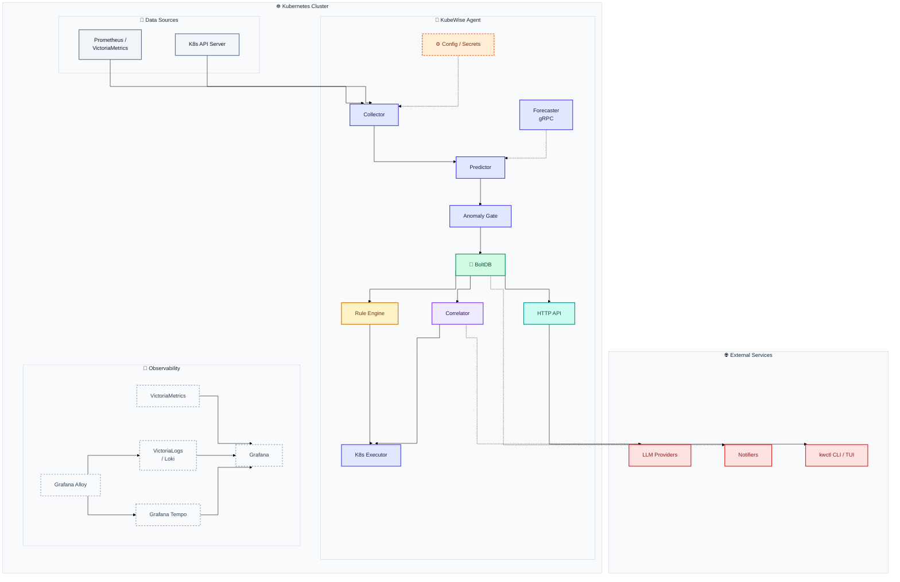
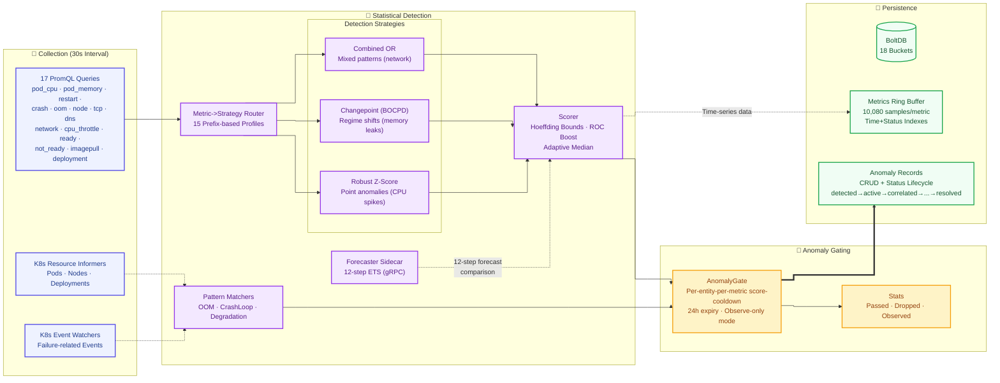
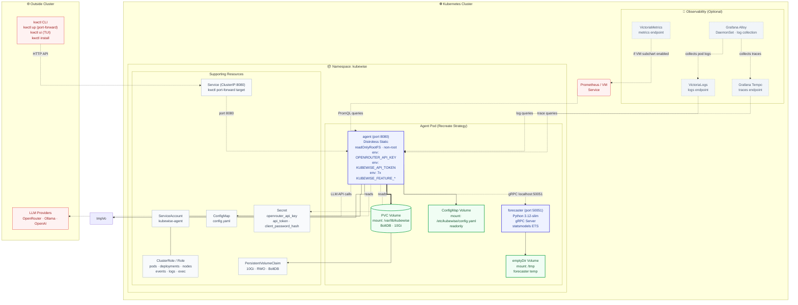

# KubeWise Architecture

This document describes the KubeWise system architecture across four views:

1. **System Overview** — high-level component diagram and data flow
2. **Detection Pipeline** — how metrics become anomaly predictions
3. **Remediation Pipeline** — how anomalies become automated fixes
4. **Deployment Architecture** — how the system runs inside Kubernetes

---

## 1. System Overview

**Data flow (30-second cycle):**
1. Collector scrapes PromQL metrics + watches K8s resources
2. Predictor runs 3 statistical strategies (Z-score, Changepoint, CombinedOR) + 3 pattern matchers
3. Anomaly Gate filters noise using score-cooldown-per-entity dedup
4. Valid anomalies persist to BoltDB
5. Correlator loads open anomalies → rule engine fast-path (8 rules) → LLM investigation → plan generation → tier assignment
6. Executor applies approved remediation (restart/scale/patch/exec)
7. HTTP API exposes all data to the CLI and external consumers

---

## 2. Detection Pipeline

**Metric routing strategy** (15 prefix entries):

| Prefix | Strategy | Min Score | Persistence |
|--------|----------|-----------|-------------|
| `pod_cpu_` | Robust Z-Score | 0.65 | 2 scrapes |
| `pod_memory_` | Changepoint | 0.50 | 2 |
| `restart_`, `crash`, `oom` | Changepoint (low threshold) | 0.30-0.40 | 1 |
| `node_` | Changepoint | 0.50 | 2 |
| `tcp_`, `dns_`, `network_` | Combined OR | 0.60 | 2 |
| `cpu_throttle` | Robust Z-Score | 0.50 | 2 |
| `pod_ready_`, `pod_not_ready` | Changepoint | 0.50 | 2 |
| `imagepull`, `deployment_` | Changepoint | 0.50 | 1-2 |
| *(default)* | Robust Z-Score | *(config default)* | *(default)* |

---

## 3. Remediation Pipeline

```mermaid
%%{init: {"flowchart": {"curve": "stepAfter", "nodeSpacing": 70, "rankSpacing": 60}}}%%
flowchart LR
  subgraph input["📥 Input"]
    anomalies("Open Anomalies<br/>detected · active · correlated"):::input
    config("RemediationConfig<br/>mode · dryRun · allowlist<br/>denylist · minConfidence"):::input
  end

  subgraph evaluate["⚡ Rule Engine (Fast Path)"]
    direction TB
    rules["8 Deterministic Rules"]:::engine
    ruleOOM["OOM → restart_pod · T1 · 0.98"]:::engine
    ruleCL["CrashLoop → restart_pod · T1 · 0.95"]:::engine
    ruleIPB["ImagePullBackOff → escalate · T3 · 0.97"]:::engine
    ruleNN["NodeNotReady → escalate · T3 · 0.90"]:::engine
    rulePend["Pending (≥5m) → escalate · T3 · 0.85"]:::engine
    ruleRR["ReadyRatio (<0.5) → scale · T2 · 0.80"]:::engine
    ruleCT["CPUThrottle (>50%) → patch · T2 · 0.75"]:::engine
    ruleMP["MemoryPressure → escalate · T3 · 0.85"]:::engine
  end

  subgraph llm_path["🧠 LLM Path"]
    direction TB
    dedup["Semantic Cache<br/>Hash-based dedup"]:::llm
    router["LLM Router<br/>T1: mistral-nemo<br/>T2: deepseek-v4<br/>T3: qwen3-coder<br/>T4: gpt-oss-120b"]:::llm
    investigation["Investigation<br/>kubectl describe · logs · events<br/>Loki query · Tempo trace"]:::llm
    diagnosis["LLM Diagnosis<br/>Root cause · Severity · Evidence"]:::llm
    plan["Plan Generation<br/>RemediationPlan struct<br/>Steps · Verification"]:::llm
    normalize["Plan Normalization<br/>Runbook validation · Namespace check<br/>Protected namespace enforcement"]:::llm
  end

  subgraph tiers["🎯 Risk Tiers"]
    direction TB
    t1["T1 · Auto-execute<br/>restart_pod · delete_pod"]:::tier
    t2["T2 · Cooldown-gated<br/>scale · rollback · patch"]:::tier
    t3["T3 · Human Approval<br/>escalate · cluster-wide"]:::tier
    t4["T4 · Always Rejected<br/>unknown · destructive"]:::tier
  end

  subgraph execution["⚙️ Execution"]
    direction TB
    dryRun["Dry-Run Check<br/>Log only · No K8s changes"]:::exec
    approval["Approval Gate<br/>ListPending · Approve · Reject"]:::exec
    k8sExec["K8s Executor<br/>restart · scale · patch · exec"]:::exec
    verify["Verification<br/>Post-remediation health poll"]:::exec
    audit[("Audit Record<br/>Prompt · Response · Result · Verdict")]:::storage
  end

  anomalies ==> evaluate
  anomalies -. "LLM-only path<br/>(feature gate off)" .-> dedup
  config --- evaluate
  config --- llm_path

  evaluate --> dedup
  dedup --> router
  router --> investigation
  investigation --> diagnosis
  diagnosis --> plan
  plan --> normalize

  normalize --> t1 & t2 & t3 & t4
  t1 --> dryRun
  t2 --> dryRun
  t3 --> approval
  t4 --> stop((Rejected))

  dryRun --> approval
  approval --> k8sExec
  k8sExec --> verify
  verify ==> audit

  classDef input fill:#eef2ff,stroke:#4f46e5,color:#1e3a8a,stroke-width:2px
  classDef engine fill:#fef3c7,stroke:#f59e0b,color:#92400e,stroke-width:2px
  classDef llm fill:#f3e8ff,stroke:#9333ea,color:#581c87,stroke-width:2px
  classDef tier fill:#fce7f3,stroke:#ec4899,color:#831843,stroke-width:2px
  classDef exec fill:#ecfeff,stroke:#0891b2,color:#164e63,stroke-width:2px
  classDef storage fill:#f0fdf4,stroke:#16a34a,color:#14532d,stroke-width:2px
```

**Rule engine — 8 built-in rules:**

| Rule | Action | Tier | Confidence | Needs LLM |
|------|--------|------|-----------|-----------|
| OOM | `restart_pod` | T1 | 0.98 | No |
| CrashLoopBackOff | `restart_pod` | T1 | 0.95 | No |
| ImagePullBackOff | `escalate` | T3 | 0.97 | No |
| NodeNotReady | `escalate` | T3 | 0.90 | No |
| Pending (≥5 min) | `escalate` | T3 | 0.85 | No |
| ReadyRatio (<50%) | `scale_replicas` | T2 | 0.80 | No |
| CPUThrottle (>50%) | `patch_resources` | T2 | 0.75 | Yes |
| MemoryPressure | `escalate` | T3 | 0.85 | No |

---

## 4. Deployment Architecture

**Key deployment notes:**
- **Recreate strategy** — required because BoltDB holds an exclusive file lock on the RWO PVC. Rolling update would deadlock.
- **Non-root containers** — both agent and forecaster run without privilege escalation.
- **Feature flags** — all 7 flags are injected as environment variables from Helm values.
- **Observability subcharts** — VictoriaMetrics, VictoriaLogs, Tempo, and Alloy deploy automatically via Helm dependencies when `agent.observability.*.enabled=true`.
- **Port-forward** — `kwctl up` creates a local port-forward to the agent service for CLI/TUI access.
